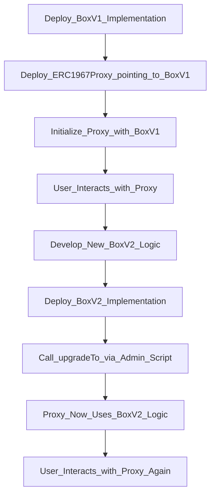

# 🔄 Upgradeable Smart Contract System

This project showcases a modular and upgrade-friendly smart contract architecture using the **UUPS (Universal Upgradeable Proxy Standard)** pattern—one of the most gas-efficient and secure proxy upgrade mechanisms. Instead of redeploying contracts and losing state, UUPS proxies allow us to **retain state in a proxy contract** while pointing to different versions of logic (implementation) contracts over time.

This architecture is essential in decentralized applications where contracts must evolve post-deployment (e.g., to fix bugs or add features) **without losing data or requiring users to switch contracts**.

We use:
- **Foundry** for efficient contract development and scripting,
- **OpenZeppelin's upgradeable contracts library** for battle-tested upgrade logic and storage handling,
- The `UUPSUpgradeable` pattern for minimal upgrade overhead.

This pattern ensures:
- 🔄 **Upgradeability**: Swap logic contracts at any time while maintaining the same proxy address.
- 💾 **Storage Preservation**: The proxy stores all variables; logic contracts only define behavior.
- 🔐 **Security**: Upgrades are restricted to the contract owner (or an upgrade manager), preventing unauthorized changes.

---

## 🧠 Contract Structure

```solidity
// BoxV1.sol
- Stores a uint256 number.
- Includes version() to identify logic version.
- Inherits from Initializable, OwnableUpgradeable, and UUPSUpgradeable.

// BoxV2.sol
- Adds setValue and getValue functionality.
- Implements _authorizeUpgrade with onlyOwner modifier.
```

---

## 🗂️ Directory Structure

```
.
├── src/
│   ├── BoxV1.sol
│   └── BoxV2.sol
│
├── script/
│   ├── DeployBox.s.sol        // Deploys proxy with BoxV1
│   └── UpgradeBox.s.sol       // Upgrades proxy to BoxV2
│
├── test/
│   └── BoxTest.t.sol
│
├── foundry.toml
└── README.md
```

---

## 🚀 Deployment Workflow

### 1. Deploy Initial Logic & Proxy
```bash
forge script script/DeployBox.s.sol --broadcast --rpc-url <RPC_URL>
```
- Deploys `BoxV1`
- Deploys `ERC1967Proxy` pointing to BoxV1
- Initializes via `initialize()` in BoxV1

### 2. Upgrade to New Logic (BoxV2)
```bash
forge script script/UpgradeBox.s.sol --broadcast --rpc-url <RPC_URL>
```
- Deploys `BoxV2`
- Uses `upgradeToAndCall()` via UUPS pattern

---

## 🔧 Proxy Upgrade Flow (Mermaid Diagram)



---

## 📜 Sample Code

### BoxV1
```solidity
function initialize() public initializer {
    __Ownable_init(msg.sender);
    __UUPSUpgradeable_init();
}
function _authorizeUpgrade(address newImpl) internal override onlyOwner {}
```

### BoxV2
```solidity
function setValue(uint256 newValue) public {
    value = newValue;
}
function version() public pure returns (uint256) {
    return 2;
}
```

---

## ⚠️ Security Considerations

- Always restrict `_authorizeUpgrade` to a trusted authority using `onlyOwner`.
- Avoid storage collisions by preserving storage layout during upgrades.
- Use `@custom:oz-upgrades-unsafe-allow constructor` for upgradeable constructors.

---

## 🛠️ Requirements

- [Foundry](https://book.getfoundry.sh/)
- OpenZeppelin Contracts Upgradeable:  
  ```
  forge install OpenZeppelin/openzeppelin-contracts-upgradeable
  ```
- Set your private key and RPC URL in `.env` or use `--private-key` and `--rpc-url` flags.

---

## 📬 Contact

If you're experimenting or building advanced upgradeable patterns, feel free to reach out or contribute ideas. Built with ❤️ by **Aditya**.

---

